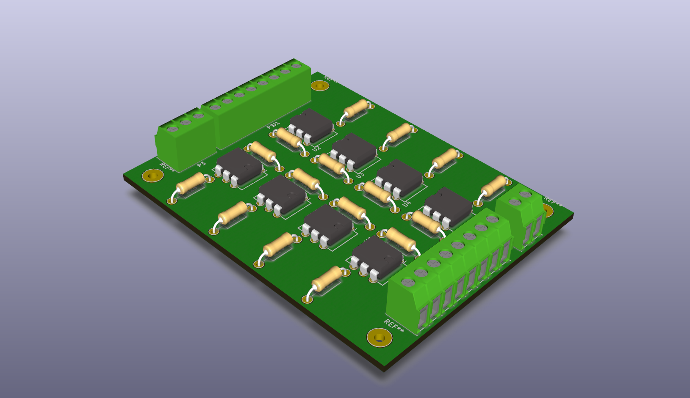

# OptoInputMinimal
This repo contains a Kicad project of a very primitive opto-isolated binary input for arduino. It contains 8 inputs. The bill of materials as follows:

* Input R: 1K
* Output R: 4.7K
* Optocoupler: 4n25
* 3.5mm screw terminal blocks (mix of 2 and 3 pin units)

# Schematic

# 3D view

